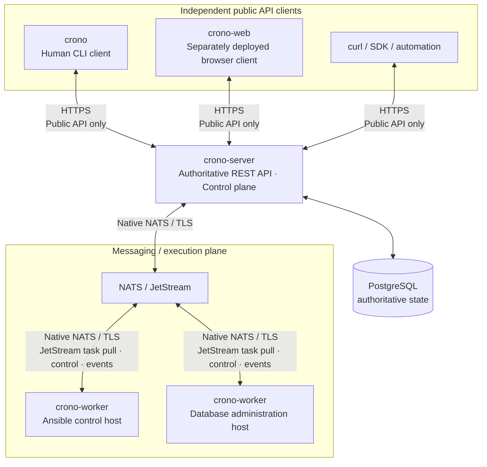

# Crono

Distributed workload automation for infrastructure and operations.

## Introduction

Crono is an open-source, API-first and messaging-first control plane for registering, versioning, triggering, scheduling, dispatching, and observing jobs on remote workers. It streams execution events, retains execution history, and will eventually compose jobs into workflows.

> Define the job centrally. Execute it where the capability exists.

Crono currently provides an API-driven server with a normalized PostgreSQL catalog, a transactional
NATS JetStream dispatch outbox, a first-class human CLI client shell, a worker CLI scaffold,
optional trace export, and a live browser client. The first execution slice deliberately dispatches
an immutable no-op Job definition; worker claims and execution outcomes remain in design.

## Workspace and development

The repository follows one release version while keeping its artifacts independently buildable:

| Package | Location | Responsibility |
| --- | --- | --- |
| `crono-server` | `services/server` | Authoritative API and control-plane daemon |
| `crono-worker` | `services/worker` | Execution-worker daemon |
| `crono-cli` (`crono`) | `apps/cli` | Human CLI client for `crono-server` |
| `crono-web` | `apps/web` | Independently deployed Leptos browser client |
| `crono-api` | `crates/api` | Transport-only JSON contracts shared by server and public clients |
| `crono-telemetry` | `crates/telemetry` | Shared native logging and optional OTLP trace export |

The root `Cargo.toml` owns the version, Rust edition, license, dependency declarations, and lint policy. Every package inherits the release version; `Cargo.lock` is shared and committed. Releases use one strict `X.Y.Z` tag for all artifacts, without a `v` prefix, and the tag must match the workspace version. The release workflow builds separate archives for `crono-server`, `crono-server-openapi`, `crono-worker`, and `crono` on each supported native target, packages the independently deployed web client, and publishes checksums with the GitHub release. A manual workflow run builds snapshot artifacts without publishing a release. Bump the version in the root manifest and regenerate the lockfile together. Release versions do not define HTTP or messaging protocol compatibility. Packages are not published to crates.io initially; native OS packages will be added only after their installation layout and service metadata are defined.

Continuous integration runs formatting, linting, feature checks, and tests before building the three native applications for Linux musl and compiling the web client with Trunk. Test and coverage jobs start PostgreSQL and NATS with the canonical local schema and JetStream configuration; dependency security audits remain separate. Crono does not declare a minimum supported Rust version; CI follows the current stable toolchain.

Use a current stable Rust toolchain with rustfmt and Clippy. The default workspace members are the
server, worker, and human CLI client; none requires browser tooling or external infrastructure to
build. The complete development workflow additionally requires Podman and `curl`; its first start
pulls the official PostgreSQL and NATS images:

```sh
cargo build --locked -p crono-server
cargo build --locked -p crono-worker
cargo build --locked -p crono-cli
just dev-start
cargo run --locked -p crono-server --bin crono-server -- --help
cargo run --locked -p crono-server --bin crono-server -- --port 8080
cargo run --locked -p crono-server --bin crono-server-openapi
cargo run --locked -p crono-worker -- -V
cargo run --locked -p crono-worker -- --version
target/debug/crono --help
target/debug/crono -V
target/debug/crono --version
```

`crono-server` starts directly, supports repeatable `-v`, and listens on port `8080` by default.
Select another internal HTTP port with `--port` or `CRONO_SERVER_PORT`. The listener prefers a
dual-stack wildcard socket and falls back to IPv4. It must remain behind a TLS-terminating reverse
proxy or equivalent trusted ingress; public clients continue to use HTTPS. Graceful SIGINT/SIGTERM
shutdown drains the HTTP server and flushes telemetry. The `just server` development recipe starts
PostgreSQL and NATS first, applies the canonical database bootstrap, and then starts the API on port
`8080` with info logging. Its optional arguments select another port and verbosity, such as
`just server 9000 -vv`.

The API exposes `GET /live`, `GET /ready`, and `GET /health`. Liveness remains process-only, while
readiness checks both PostgreSQL and NATS JetStream and returns `503` when either is unavailable.
The detailed health response contains the package name, version, and source commit and includes an
`X-App` build-identity header. `crono-server-openapi` prints the OpenAPI document generated from the
same route registration used by the server. It does not expose runtime documentation or Swagger UI.

The `/api/v1` control-plane contract creates and reads Namespaces, Namespace-scoped Jobs and
Targets, Runs, and visible overview counts. Creating a Job also creates immutable no-op version 1.
Creating a Run requires qualified `namespace/resource` names, pins that Job version and Target, and
uses a client-generated request UUID as an idempotency key. The transactional outbox publishes to
`crono.dispatch.<queue>` and changes the Run from `pending_dispatch` to `dispatched` only after a
JetStream acknowledgement. The generated OpenAPI document is the authoritative route inventory.

`crono-worker` retains its `run` subcommand and intentionally reports that its runtime is not
implemented. The server publishes durable no-op dispatch envelopes, but no worker consumes or
executes them yet. Help and version output work without telemetry initialization.

The `crono-cli` package produces the `crono` executable. It resolves its future API base address in
this order: `--address`, `CRONO_ADDR`, then the local-development default
`http://127.0.0.1:8080`. Addresses are parsed as URLs, limited to HTTP or HTTPS, and rejected when
they contain user-info, query strings, or fragments. Plain HTTP is accepted only for loopback
development addresses; deployed servers use HTTPS. There is no HTTP transport, authentication,
token storage, or operational command yet. The server and browser now exercise the first Job/Run
API slice, while CLI command design remains separate work. Valid CLI configuration therefore ends
with an explicit unfinished-command error and never opens a connection.

Use `-V` for short versions such as `crono 0.1.0` and `--version` for long versions such as
`crono 0.1.0 - <commit>`; both daemons follow the same convention. The shared native build script
uses `built` with `git2` to embed the full Git commit hash, falling back to `unknown` when Git
metadata is unavailable. Help uses yellow headings, green usage/placeholders, and blue command
names, with automatic terminal detection; piped output stays plain and `NO_COLOR` disables colors.

The GUI provides live Overview, Namespace, Job, Target, and Run workflows alongside reserved Target
Set, Worker, and Settings pages. It calls the public `/api/v1` contract through a browser-only client
module; Trunk proxies that path to `127.0.0.1:8080` during development. It uses Tailwind CSS v4
through Trunk's standalone Tailwind pipeline and Material Symbols Outlined for its icon vocabulary.
Install the WASM target and Trunk (validated with Trunk 0.21.14), then build or serve it independently:

```sh
rustup target add wasm32-unknown-unknown
cargo install --locked trunk --version 0.21.14
just web
just dev-start
# Or: cd apps/web && trunk build --release
```

`just web` listens on `0.0.0.0:3000` for remote browser testing while leaving the API's default
port `8080` available. Pass an address and optional port to override it, such as
`just web 127.0.0.1 3001`. `just dev-start` is the normal full-stack entry point: it starts the web
and API servers in parallel while the API recipe ensures local PostgreSQL and NATS services are
ready. It accepts the web address, web port, server port, and server verbosity in that order.
Interrupting Just stops the web and API processes; `just dev-stop` stops the infrastructure
containers while retaining their data for the next development session.

The web recipe uses Trunk's development server directly. Trunk watches the Rust, HTML, CSS, and
asset inputs, recompiles the WASM bundle after saved changes, and reloads connected browsers. A
separate `cargo-watch` process is unnecessary and would duplicate the frontend build watcher.

Trunk produces static assets under `apps/web/dist`; these are hosted separately from the server.
Development authentication currently establishes a fixed server-owned principal and grants every
typed capability. The boundary is exercised on every use case and can be replaced without changing
domain or persistence code; see [authentication and authorization](AUTHORIZATION.md). See also
[the GUI README](apps/web/README.md), [CLI architecture](CLI_ARCHITECTURE.md), and [workload domain
model](DOMAIN_MODEL.md).

Local structured JSON logging is always available on stderr. Logging defaults to errors; `-v`, `-vv`, and `-vvv` select info, debug, and trace. `RUST_LOG` overrides that default. Trace export requires both an optional build feature and startup configuration:

```sh
cargo build --locked -p crono-server -p crono-worker --features telemetry
OTEL_EXPORTER_OTLP_ENDPOINT=http://localhost:4317 target/debug/crono-server -v --port 8080
```

This example exports server and HTTP request spans until the process receives a shutdown signal. The exporter supports gRPC, gzip, verified HTTPS using WebPKI roots, and standard OTLP header environment variables. `OTEL_EXPORTER_OTLP_ENDPOINT` explicitly enables export and selects its destination; without it, even a telemetry-enabled binary only logs locally. Default builds ignore exporter configuration. Trace export and shutdown are bounded; shutdown failure can lose pending traces and is reported without replacing the action's exit status. More detail is in [CLI architecture](CLI_ARCHITECTURE.md#telemetry).

The `.justfile` provides `dev-start` as the complete local workflow and keeps `server`, `web`,
`dev-infra`, `postgres`, `nats`, and `cli` available for focused work. PostgreSQL 18 uses the
`crono-postgres-data` named volume and is bootstrapped idempotently from `db/sql/00_init.sql`. NATS
uses the `crono-nats-data` volume, enables JetStream, serves clients at `nats://127.0.0.1:4222`, and
exposes its development-only monitoring endpoint at `http://127.0.0.1:8222`. Both services bind to
loopback and are intentionally unauthenticated for local development only. Run `just postgres` or
`just nats` when only one dependency is needed.

Keep `just server` running in one terminal while using `just cli --help` in another when working
without the GUI. The CLI recipe forwards its arguments unchanged, so `--address`, `CRONO_ADDR`, and
the local default retain their documented
precedence. The client currently validates its configuration but has no operational API command;
use `curl http://127.0.0.1:8080/health` to inspect the implemented API directly. Code-validation and
database bootstrap/verification helpers remain available. The code checks cover native code with
default and all features; `clippy` also checks the browser WASM target.

```sh
cargo fmt --all -- --check
just clippy
just test
```

Native workspace checks include a tooling-only GUI entrypoint; they do not validate browser rendering. A Trunk release build and browser inspection complete the frontend checks. Telemetry integration tests use an ephemeral local gRPC collector; no external collector is required.

## Why Crono

Operational automation is spread across cron, systemd timers, administration hosts, CI pipelines, and custom programs. Crono gives it a common job registry, execution path, and history.

Crono coordinates Ansible, Terraform/OpenTofu, PostgreSQL utilities, Kubernetes tooling, shell programs, backup tools, and custom executables. Those tools keep their own responsibilities. Crono decides when and where a registered job should run; the worker manages its execution environment.

## Architecture

The planned execution topology has four runtime components: `crono-server`, `crono-worker`,
PostgreSQL, and NATS with JetStream enabled. `crono` and `crono-web` are independent peer clients of
the public server API. The server does not embed or serve either client.

> All external control-plane clients interact with Crono through the public `crono-server` API. The CLI and browser are clients, not alternate execution paths.



`crono-server` remains a modular monolith. Its HTTP API, authorization-aware application layer,
PostgreSQL adapter, and outbox dispatcher are logical Rust modules in one deployable process;
scheduling, worker control, and event processing remain future modules. `crono` and `crono-web` use
its public API and have no Rust dependency on the server. `crono-api` shares transport DTOs without
exposing server domain or persistence types. `crono-worker` remains the separate execution process.

Workers receive tasks directly from NATS JetStream using durable pull consumers over persistent native NATS/TLS connections. These are NATS pull requests, not HTTPS polling. Claims, lease renewals, and execution events also travel directly over NATS. Workers have no PostgreSQL connection, normal-operation HTTP server, or inbound worker ports. The CLI and browser connect only to `crono-server` over HTTPS in deployed environments.

Keep one server deployment initially. Add worker capacity through queues; split control-plane services only when measured scaling or failure-isolation needs justify the operational cost.

## Communication model

| Client or responsibility | Transport | Boundary |
| --- | --- | --- |
| Browser, human CLI, SDK, and automation | HTTPS to `crono-server` | Public authentication and authorization |
| Worker dispatch and important execution events | Native NATS with JetStream | Durable delivery and redelivery |
| Worker claims, lease renewal, control, presence | Core NATS | Low-latency request/reply or transient messages |
| Authoritative persistence | Server to PostgreSQL | Workers and clients never access the database |

Native NATS is a distinct protocol, not HTTPS. A conceptual endpoint is `nats://nats.example.internal:4222`; production connections must require TLS, certificate verification, and authentication. TLS-secured native connectivity can use `tls://nats.example.internal:4222`, depending on client configuration. See [NATS TLS documentation](https://docs.nats.io/learn/security/encryption). WebSocket/WSS transport is outside v0.1.

Public clients must not receive NATS credentials or connect directly to NATS. Keeping HTTPS as the
only external control-plane boundary centralizes authorization, simplifies client security, and
preserves a stable public API independent of messaging internals. Automation may eventually use
scoped service credentials, but it still creates Runs through `crono-server`; only the control
plane publishes dispatch messages.

Normal worker traffic flows directly between workers and NATS. The server consumes events and handles authoritative decisions; it does not proxy each message into the bus. This avoids HTTP request overhead, duplicated serialization, connection churn, and extra network hops.

## Core domain model

```text
Namespace
   |
   +-- Job -> JobVersion
   +-- Target
   +-- TargetSet

JobVersion + Target/TargetSet + Inputs
                    |
                    v
                   Run -> RunAttempt -> Worker -> Executor
```

| Concept | Meaning |
| --- | --- |
| Namespace | Organizational boundary, such as `mariadb` or `postgres` |
| Job | What to execute, independent of a destination, such as `mariadb/backup` |
| JobVersion | Immutable execution definition; modifying a Job creates a new version |
| Target | Where or against what a Job executes, such as `mariadb/host-123` |
| TargetSet | Named explicit selection of unique Targets in one Namespace |
| Run | One requested execution, with validated inputs and pinned definitions |
| RunAttempt | One attempt to perform that Run, with its own identity, worker assignment, lease, and outcome |
| Worker | An identified execution process serving authorized queues |
| Executor | A generic execution primitive; initially `process` |

> Crono models WHAT to execute separately from WHERE to execute it. Jobs describe behavior; Targets describe execution destinations/resources. Executor-specific concepts such as Ansible inventory remain outside the core domain.

For example, `inventories/mariadb/host-123.yml` maps conceptually to Target
`mariadb/host-123`, while `playbooks/mariadb/backup.yml` maps to Job
`mariadb/backup`. The inventory is executor-specific target data, not a Job and
not a core Ansible abstraction. The same model supports clusters, workspaces,
database instances, and API endpoints.

For example, Run 42 may have Attempt 1 with a lost worker and Attempt 2 that succeeds, if retry is permitted. Retrying creates a new RunAttempt; it does not overwrite the old attempt or change the pinned JobVersion. Message redelivery alone does not create an attempt.

Immutable versions make definitions auditable and support reproducibility and debugging. They do not freeze installed tools, external infrastructure, or mutable artifacts; those dependencies must also be pinned when reproducibility requires it.

Target configuration will require the same reproducibility guarantee. A
`TargetVersion` is intentionally deferred until target configuration and Run
contracts exist; before execution is implemented, a Run must pin the exact
Target definition as well as its JobVersion and inputs. TargetSet fan-out and
membership snapshot semantics are also deferred. The complete invariants,
Ansible mapping, and intended GUI/API/CLI organization are documented in the
[workload domain model](DOMAIN_MODEL.md).

Queues route work. Labels and capabilities are future placement inputs, not a sophisticated scheduler in v0.1.

## Job execution lifecycle

### 1. Create and persist a Run

Public HTTP Run requests enter one server-side creation path. The application
validates qualified names, authorizes Run creation, Job execution, and Target
use, then resolves the current immutable JobVersion and Target identity. It
commits the Run and outbox record in one PostgreSQL transaction. Reusing a
request UUID with the same inputs returns the existing Run; different inputs
produce an idempotency conflict. Scheduling, RunAttempt allocation, and the
TargetVersion required for real execution are not implemented yet.

### 2. Publish through the transactional outbox

A database commit followed by a separate NATS publish has a crash window: the Run can exist without ever being dispatched. The outbox records the publication intent atomically with the Run.

```text
PostgreSQL transaction: Run + outbox record
                          |
                        commit
                          |
             dispatcher publishes to JetStream
                          |
            record publication after broker confirmation
```

The dispatcher retries pending outbox records. A crash after publication but before recording it can produce duplicates, so publication IDs and idempotent processing remain necessary. No PostgreSQL transaction is held open while waiting for a NATS round trip or job execution.

A small dispatch envelope identifies the committed work:

```json
{
  "schema_version": 1,
  "dispatch_id": "...",
  "run_id": "...",
  "job_version_id": "...",
  "target_id": "...",
  "queue": "default"
}
```

The implemented no-op slice stops at acknowledged dispatch. A future execution
slice allocates attempts and defines how later retries create another attempt
and outbox record atomically.

### 3. Pull, claim, and obtain the execution specification

A worker pulls only when it has execution capacity. Receiving a dispatch message does not authorize execution.

The worker requests `crono.control.claim` over NATS with the Run and attempt identities. The server verifies the authenticated worker, queue permission, pinned version, and attempt eligibility, then atomically grants or denies ownership in PostgreSQL. At most one attempt per Run may hold an active execution lease.

A grant identifies `run_id`, `attempt_id`, `worker_id`, `lease_id`, and `lease_expires_at`. A repeated claim request must not allocate another lease or authorize a second process. A timeout is not a grant; the worker must recover the decision through an idempotent request.

Workers cannot read PostgreSQL, so the execution specification needs an explicit delivery path:

| Approach | Benefit | Cost |
| --- | --- | --- |
| A: include the complete immutable specification in dispatch | No specification lookup after delivery | Repeats large definitions and inputs in durable messages and redeliveries; increases broker storage and payload exposure |
| B: obtain it through NATS request/reply | Small dispatch messages; explicit version and access checks; stateless workers | Depends on an available server and adds a round trip if fetched separately |

Recommend **B**, returning the immutable specification and validated Run inputs in the successful claim reply. The claim already requires a server/database decision, so combining the response avoids an additional fetch round trip. PostgreSQL stays canonical, workers need no HTTP or persistent cache, and every response names the pinned version. An optional bounded in-memory cache can be evaluated later.

### 4. Execute

After a valid claim, the worker starts the process executor. It owns process lifecycle, execution environment, timeout enforcement, stdout/stderr capture, and cancellation.

```text
crono-worker -> process executor -> ansible-playbook / pgbackrest / patronictl / tofu / custom program
```

The worker may execute only while its confirmed lease is valid. On renewal failure it must attempt to stop the process by the lease deadline; stopping a local process cannot guarantee that a remote side effect stopped.

### 5. Publish events

Workers publish directly to NATS: `started`, `stdout`, `stderr`, `progress`, `succeeded`, `failed`, or `cancelled`. Events identify the Run, attempt, and lease, with stable event identities and per-attempt ordering information.

The server's event processor validates transitions and persists authoritative state changes promptly. Duplicate or delayed events must not regress state. Output takes a bounded buffering/batching path, described below.

### 6. Renew leases

Worker presence heartbeats and active execution lease renewal are different concerns. Presence can be transient; a heartbeat alone does not extend permission to execute.

Active leases renew through NATS request/reply. Initially, acknowledge a new lease deadline only after its conditional PostgreSQL update commits. Validate the worker, attempt, and current unexpired lease using control-plane/database time.

Presence updates may be coalesced. Later, lease updates may be batched or assisted by a short-lived in-memory view, but no acknowledged lease extension may exist only in memory. Timing margins, clock assumptions, and restart behavior must be settled before implementation.

### 7. Commit completion, then finalize delivery

The worker publishes a durable completion event and continues lease renewal until the server confirms a durable disposition. Before applying a new completion, the server atomically validates the active attempt/lease and commits the attempt outcome, Run state, and authoritative event in PostgreSQL. A duplicate returns the already recorded outcome; stale or conflicting reports cannot replace it. Late reports remain evidence for reconciliation without reviving an expired lease.

JetStream publication confirmation means the broker stored the event, not that PostgreSQL accepted completion. The event processor acknowledges durable events only after their database outcome is recorded. The worker obtains application-level completion confirmation over NATS, with an idempotent status request if the confirmation is lost, before acknowledging dispatch.

A redelivered dispatch may be retired only after the control plane confirms a persisted terminal or superseded disposition. A denied claim because another worker is active is not permission to discard the work. ACK ownership, timeout/retry behavior, and rejection handling are Phase 0 protocol decisions; neither early ACK nor lost replies may silently lose work.

## NATS and JetStream

Core NATS handles transient request/reply, claims, control messages, and some heartbeats. Its requests need bounded timeouts and explicit idempotent retries when responses are lost. JetStream supplies persistence and at-least-once delivery for dispatch and important execution events; every message does not need persistence.

A deliberately small, provisional semantic subject hierarchy:

| Subject | Purpose |
| --- | --- |
| `crono.dispatch.<queue>` | Durable execution envelopes |
| `crono.control.claim` | Worker claim and execution-specification reply |
| `crono.control.<operation>` | Registration, renewal, completion inspection, and optional cancellation control |
| `crono.worker.heartbeat` | Worker presence |
| `crono.run.started` | Durable attempt-start event |
| `crono.run.event` | Output/progress, with explicit retention and loss policy |
| `crono.run.completed` | Durable completion event |

These are conventions, not a frozen wire protocol or blanket wildcard permissions. Phase 0 must settle identity scoping, targeted control delivery, and protocol versioning. Subjects express operations and events, not database tables.

Conceptually, `CRONO_DISPATCH` covers `crono.dispatch.*`. Queue names are single subject tokens; a `postgres` queue maps to `crono.dispatch.postgres`. Workers for a queue share a durable pull consumer filtered to that queue, distributing work across the pool. Consumer ownership belongs to the queue, not an individual worker. See [NATS worker pools](https://docs.nats.io/learn/jetstream/worker-pool).

Use explicit acknowledgments and bounded pulls. Long-running executions need delivery-progress signaling while awaiting completion; JetStream's delivery timer is separate from the PostgreSQL execution lease. Extending one does not extend the other. See [NATS acknowledgment and redelivery](https://docs.nats.io/learn/jetstream/acknowledgment).

Important events use a durable server-side consumer. Retention, delivery limits, and exhausted delivery handling must preserve recovery from PostgreSQL and expose unresolved work. Stream configuration, replica counts, and production defaults are intentionally deferred.

## PostgreSQL

> PostgreSQL is authoritative state. NATS is transport.

Conceptual persistent records include `jobs`, `job_versions`, `runs`, `run_attempts`, `run_events`, `schedules`, `workers`, `leases`, `queues`, and `outbox`. This is a responsibility map, not a schema.

If NATS is rebuilt, PostgreSQL must still explain which jobs and versions exist, which Runs happened, their states, attempts, outcomes, and retained execution history. Broker acknowledgments and stream retention are not execution history.

Recovery must reconcile pending dispatch and uncertain attempts against PostgreSQL before republishing eligible work. Rebuilding NATS can lose uncommitted in-flight evidence; record uncertainty instead of inventing success or blindly replaying side effects.

## Workers

Place workers close to the infrastructure and tools they operate: an Ansible control machine, database administration host, or Kubernetes administration host.

A conceptual worker declaration:

```yaml
worker:
  name: db-zrh-01
  queues:
    - postgres
  capabilities:
    - process
  labels:
    site: zrh
    environment: production
```

Registration associates this declaration with a provisioned identity; a claimed name or queue is not an authorization grant. v0.1 uses explicitly assigned queues for routing, with process-capable workers. Labels and additional capabilities remain future placement inputs.

Workers initiate persistent outbound NATS connections and pull within available capacity. They are disposable execution processes; correctness and history must not depend on worker-local storage.

## Executors

The first executor is `process`. `container` and `http` are possible later primitives.

Ansible, Terraform/OpenTofu, PostgreSQL utilities, `kubectl`, `pgBackRest`, and `Patroni` do not need dedicated executor implementations. They are programs available in the worker's execution environment.

```yaml
name: patch-linux-hosts
queue: ansible
executor:
  type: process
  command: /usr/bin/ansible-playbook
  args:
    - /srv/ansible/playbooks/site.yml
```

The server needs no Ansible installation. The worker host provides the executable, files, credentials, and infrastructure access. Examples describe intended definitions, not a finalized configuration format.

## Scheduling

Scheduling only creates Runs through the shared creation logic.

```text
REST API --------+
NATS request ----+--> create Run --> persist/outbox --> JetStream --> worker
scheduler -------+
future trigger --+
```

The scheduler remains a module inside `crono-server` and comes after the manual execution slice. Basic schedules should identify occurrences so restarts do not create duplicate Runs. Time zones and missed-occurrence policy need design before scheduling ships. Calendars and separate scheduler services are future concerns.

## Reliability model

Crono's foundational invariants are:

- PostgreSQL is authoritative; NATS is transport.
- JetStream delivery is at-least-once.
- Executions use attempts; attempts use leases.
- Workers are disposable; jobs are immutable by version.
- State transitions and control requests must be idempotent.

Crono uses **at-least-once delivery with control-plane guarded execution**. Claims prevent the control plane from intentionally authorizing concurrent owners of the same attempt or concurrent active attempts of one Run. They do not guarantee exactly-once execution or fence arbitrary external systems.

An expired lease does not prove a process or remote operation stopped. External idempotency keys, resource fencing, or reconciliation may be needed for safe retries. Unknown outcomes must remain visible, and v0.1 must not automatically retry uncertain non-idempotent work. The exact Run/attempt state machines and recovery policy are Phase 0 work.

| Failure scenario | Expected invariant and remaining design work |
| --- | --- |
| Worker receives dispatch and dies before claim | No execution was authorized. Unacknowledged delivery returns to the queue; another worker can claim the pending attempt. |
| Worker claims and dies before execution | Keep ownership until lease expiry, then record a lost/uncertain attempt. The server cannot infer that nothing started; any permitted retry uses a new attempt. |
| Worker dies during execution | Lease expiry makes lost ownership visible. Processes or remote work may survive; retry policy must account for partial side effects. |
| External operation completes, but worker dies before reporting success | Outcome remains unknown. Reconcile or require an explicit retry decision; message durability cannot establish success or prevent repeated effects. |
| NATS redelivers dispatch | Check the same persisted attempt and lease. Do not start a second process, allocate a retry, or discard active work solely because it was delivered again. |
| Server crashes after PostgreSQL commit but before publication | The outbox retains dispatch intent and resumes publication. Duplicate publication is safe to process. |
| Duplicate completion event arrives | Return the recorded outcome without applying another transition. Conflicting/stale events cannot overwrite a newer result. |
| Stale worker heartbeats an expired lease | Reject renewal; never revive the lease or displace a newer attempt. Worker presence alone grants no ownership. |

If PostgreSQL is unavailable, new claims, renewals, and completion confirmations cannot succeed. If NATS is unavailable, workers cannot obtain new authority. Existing workers act only within confirmed lease deadlines. Recovery must handle delayed events without assuming cross-subject delivery order.

## Security model

Clients invoke registered jobs with validated inputs. Permission to register or version executable definitions is separate from permission to trigger them. Pass structured arguments to the process executor; avoid implicit shell interpolation and restrict dangerous input options. A process executor runs with its host account's privileges and is not a security sandbox.

Production NATS connections require TLS and authenticated identities. NKEYs, credentials, or JWT/accounts are possible mechanisms; v0.1 should use simple provisioned identities rather than an elaborate identity platform.

Use [NATS subject-level authorization](https://docs.nats.io/learn/security/authorization) to restrict publication and subscription, including JetStream pull/ACK APIs and reply inboxes:

- Workers consume only authorized queues and publish only permitted execution/control messages; they cannot create Runs or publish dispatch.
- Trusted services may request permitted jobs, but cannot publish dispatch or impersonate workers.
- Only the control plane publishes executable dispatch and handles authoritative decisions.
- Workers do not administer streams/consumers or receive unrelated clients' replies.

Broker authentication does not by itself authenticate a self-reported `worker_id` to an application handler. Bind requests and events to a verifiable caller identity, using authenticated request credentials or identity-scoped subjects enforced by broker permissions. Choose that binding in Phase 0; broad shared subjects and payload IDs alone are insufficient.

Keep secrets out of job definitions, dispatch envelopes, and retained logs. Use references and worker-local credentials with least privilege; provider integrations can follow later. Limit payload sizes and redact sensitive output. An unavailable or invalid authorization decision never grants execution.

## Performance principles

Performance must be benchmark-driven; no throughput or latency numbers are promised.

1. Reuse persistent PostgreSQL and NATS connections.
2. Use async I/O without blocking runtime threads.
3. Use NATS for high-frequency worker communication.
4. Bound concurrent jobs, execution processes, Tokio tasks, database writes, and outstanding NATS requests.
5. Batch work only where durability semantics permit.
6. Keep dispatch envelopes small and bound all message sizes.
7. Use immutable definitions and explicit version identities.
8. Minimize serialization and network hops.
9. Never synchronously write every stdout/stderr line to PostgreSQL.
10. Keep database transactions short and focused on authoritative state changes.
11. Use pull consumption for natural worker backpressure.
12. Let workers reach NATS directly; keep the control plane focused on coordination.

Execution output follows `worker -> NATS -> event processor`. State transitions go promptly to PostgreSQL; output may be buffered and batched. Define explicit limits for worker concurrency, event batches, database pools, NATS pending messages, and log buffers without inventing production defaults.

Reserve capacity for lease renewal and completion so output floods cannot starve control traffic. Buffer saturation must trigger a defined backpressure or truncation policy with visible gaps, never unbounded memory growth. Output retention and loss guarantees must be explicit.

Large logs may eventually move to object storage, with references and metadata in PostgreSQL. Unlimited raw output storage is outside v0.1. Measure dispatch-to-start latency, claim/renewal latency, event lag, and database pressure before adding caches, services, or tuning complexity.

## v0.1

The first milestone is one vertical slice:

1. Register a Namespace, Job, and Target.
2. Create an immutable JobVersion and exact versioned Target definition.
3. Trigger a Run through the HTTP API with a JobVersion, Target, and inputs.
4. Persist the Run, pending attempt, and outbox.
5. Dispatch through JetStream.
6. Let a worker pull the dispatch.
7. Claim the attempt over NATS and receive its specification.
8. Execute a process with timeout and lease handling.
9. Publish basic state and bounded output events.
10. Persist the final state on the server.
11. Inspect the result, attempts, and retained history through the API.

This includes `crono-server`, `crono-worker`, HTTP API, PostgreSQL, NATS/JetStream, a process executor, basic worker registration/identity, and basic run events. Include cancellation only if its request, process-stop, and terminal-state semantics remain simple; it must not imply rollback of external effects.

A full Web UI, additional API clients, scheduling, and automatic retry policies are not prerequisites for this first slice. Worker NATS control operations are required from the start.

Excluded from v0.1: workflow DAGs, graphical workflow builders, Kubernetes executors, Terraform-specific or Ansible-specific integrations, complicated RBAC, multi-tenancy, approvals, calendars, plugin frameworks, distributed scheduler services, separate microservices, large-scale log storage, and WebSocket NATS transport.

## Future direction

Workflows are not part of the first implementation milestone. Later composition should reuse ordinary Runs and attempts; no DAG engine is designed here.

Possible later work includes scoped API automation clients, basic scheduling, a minimal Web UI, container/HTTP executors, explicit retry policies, placement using labels/capabilities, secrets providers, and object-backed logs. Advanced authorization, tenancy, calendars, approvals, and high availability require demonstrated needs and separate designs.

## Status

Workspace scaffold implemented: independently buildable daemons, a server-independent `crono` API
client shell, shared optional telemetry, a routed Leptos GUI foundation, and pure server-side domain
identities for Namespaces, Jobs, Targets, and TargetSets. PostgreSQL, NATS, target configuration and
versioning, job execution, authentication, and public workload application APIs are not
implemented. The next step is to freeze the smallest coherent execution protocol and its failure
behavior before implementing the runtime.

## First implementation steps

These are the remaining ordered design and runtime milestones; the workspace scaffold does not implement them.

1. **Phase 0 — architecture freeze:** settle domain terminology, Run/attempt state machines, subject conventions, identity binding, claim/lease semantics, completion and ACK rules, bounded output/loss policies, and failure scenarios.
2. **Phase 1 — control plane skeleton:** establish the server, PostgreSQL and NATS boundaries, Namespace/Job/Target/version/Run model, and transactional outbox.
3. **Phase 2 — worker protocol:** define registration, queue-scoped JetStream pull, claim/specification response, heartbeat, lease renewal, and recovery.
4. **Phase 3 — process executor:** start and stop processes, capture bounded stdout/stderr, enforce timeout, and commit results through the completion protocol.
5. **Phase 4 — observability:** expose event history, Run/attempt inspection, and a minimal API; add a minimal UI when useful.
6. **Phase 5 — scheduling:** create Runs through the same control-plane path with explicit occurrence and missed-run semantics.

## License

BSD 3-Clause. See [LICENSE](LICENSE).
