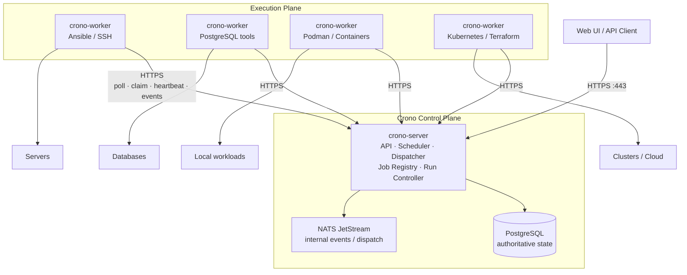
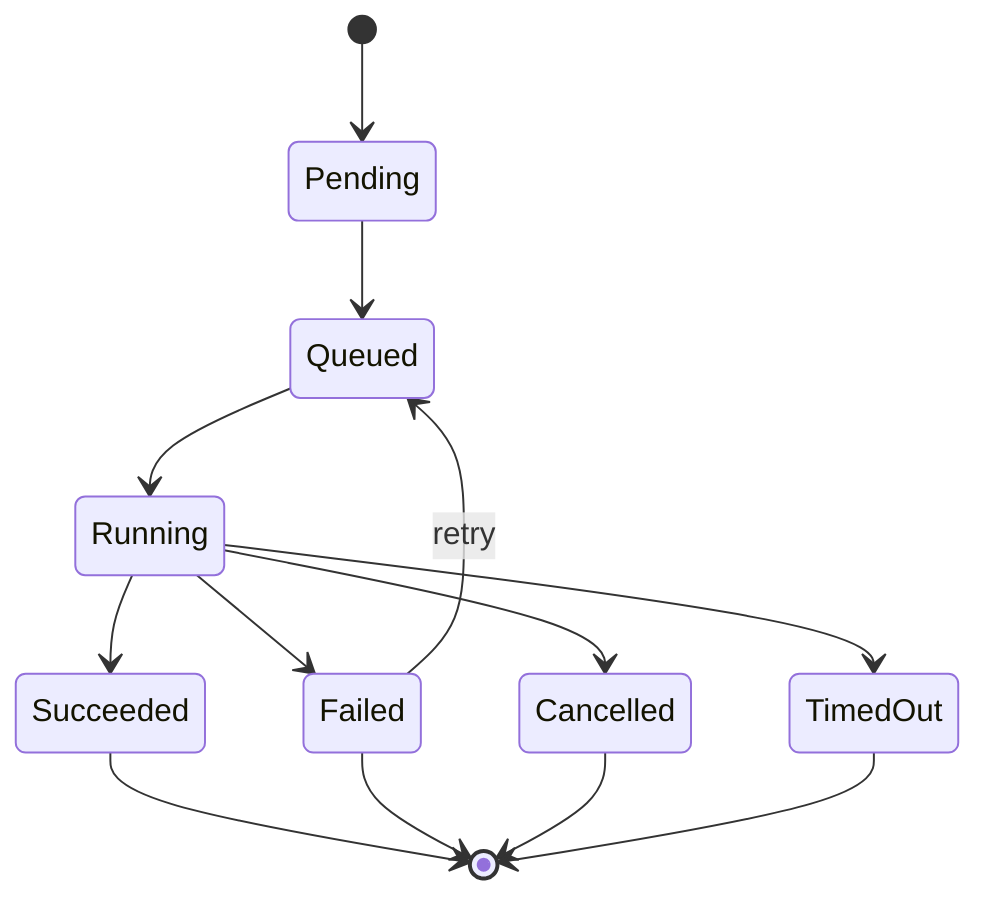
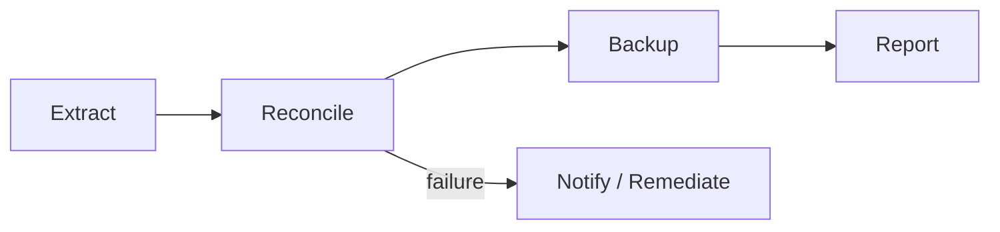

# Crono

**Distributed workload automation for infrastructure and operations.**

Crono is an open-source, API-first workload automation control plane for registering, scheduling, dispatching, and observing operational jobs across distributed infrastructure.

> Define the job centrally. Execute it where the capability exists.

Crono is currently an early-stage prototype.

## Why Crono?

Infrastructure automation often ends up spread across:

- cron and systemd timers
- shell scripts
- Ansible control hosts
- database maintenance servers
- CI pipelines
- Kubernetes jobs
- Terraform/OpenTofu runners
- custom operational tools

Crono provides a common control plane above these tools without trying to replace them.

A Crono worker can execute an Ansible playbook, run `pgBackRest`, invoke `patronictl`, execute a program, start a container, call an HTTP endpoint, or perform another registered operational task.

Crono manages **when, where, and why** a job runs.

The worker manages **how** it runs.

## Architecture



Workers initiate connections to the Crono control plane.

They do **not** require inbound connectivity and do not need direct access to PostgreSQL or NATS.

A worker only needs:

```text
crono-worker -> HTTPS -> crono-server
```

This allows workers to live close to the infrastructure they operate.

## Core model

Crono intentionally keeps the execution model small:

```text
Job
 ↓
Job Version
 ↓
Run
 ↓
Queue
 ↓
Worker
 ↓
Executor
 ↓
Result
```

### Job

A reusable operational task.

Examples:

```text
postgres-backup
postgres-vacuum
ansible-patching
restart-service
terraform-apply
rotate-certificates
deploy-application
```

### Job Version

An immutable version of a job definition.

Every run references the exact version that was executed, making historical executions reproducible and auditable.

### Run

One invocation of a job.

A run contains its inputs, state, timestamps, execution attempts, worker assignment, logs, and result.

### Worker

A long-running Crono process installed close to the infrastructure where jobs must execute.

Workers advertise queues and capabilities and pull work from the control plane.

### Executor

The mechanism used by a worker to execute a job.

Initial executor types are expected to be:

```text
process
container
http
```

Higher-level tools such as Ansible do not require special Crono integration. They can be executed through a generic executor.

## Example: Ansible

The Crono server does not need Ansible installed.

A worker placed on an existing Ansible control host can execute it locally.

```text
                       crono-server
                            │
                         HTTPS
                            │
                            ▼
                     crono-worker
                            │
                   ansible-playbook
                            │
                            ▼
                      target hosts
```

Example job definition:

```yaml
name: patch-linux-hosts
queue: ansible

executor:
  type: process
  command: /usr/bin/ansible-playbook
  args:
    - -i
    - /srv/ansible/inventory/production
    - /srv/ansible/playbooks/patch.yml

timeout: 1h
```

Crono only needs to know how to dispatch and observe the job.

The worker host owns the execution environment:

```text
/usr/bin/ansible-playbook
/srv/ansible/
/etc/ssh/
/etc/ansible/
```

## Workers

Workers can be specialized for different environments.

For example:

```yaml
worker:
  name: db-worker-zrh-01

  queues:
    - postgres
    - database

  capabilities:
    - process
    - container

  labels:
    site: zrh
    environment: production
```

Another worker may provide Ansible:

```yaml
worker:
  name: ansible-zrh-01

  queues:
    - ansible
    - linux

  capabilities:
    - process

  labels:
    site: zrh
    environment: production
```

This allows Crono to route jobs to execution environments without becoming an infrastructure inventory system itself.

## Example execution

A job can be started through the API:

```http
POST /api/v1/jobs/postgres-vacuum/runs
```

```json
{
  "inputs": {
    "cluster": "postgres-prod-01",
    "database": "orders"
  }
}
```

Crono creates a run:

```json
{
  "id": "run_01K...",
  "job": "postgres-vacuum",
  "version": 4,
  "state": "queued"
}
```

Execution then follows:

```text
API / Schedule / Event
        │
        ▼
     create Run
        │
        ▼
    PostgreSQL
        │
        ▼
      Queue
        │
        ▼
 worker claims Run
        │
        ▼
     Executor
        │
        ▼
 operational command
        │
        ▼
 events / logs / result
        │
        ▼
    crono-server
```

## Run lifecycle



Worker claims and state transitions are persisted in PostgreSQL.

Message delivery must not be treated as proof that a job should execute. Workers atomically claim runs before starting execution so that message redelivery does not create multiple active executions of the same run.

## PostgreSQL and NATS

Crono uses PostgreSQL as the authoritative state store.

```text
PostgreSQL = state
NATS       = transport/events
```

PostgreSQL stores objects such as:

```text
jobs
job_versions
runs
run_attempts
run_events
schedules
workers
queues
outbox
```

NATS JetStream can be used internally for:

```text
dispatch
events
notifications
control-plane communication
```

Workers should not depend directly on NATS.

`crono-server` exposes the worker protocol through HTTPS so that deployment only requires normal web connectivity.

## Scheduling

Schedules create runs through the same execution pipeline used by API-triggered jobs.

```text
HTTP API ──────────┐
                   │
Cron schedule ─────┼──> Run ──> Queue ──> Worker
                   │
Event trigger ─────┘
```

Crono should eventually support both normal cron expressions and richer operational calendars.

Examples include:

```text
every weekday at 23:00
last working day of the month
first business day after quarter close
business-day calendars
```

## Workflows

Crono is initially focused on jobs, but the data model should allow jobs to later be composed into workflows.



A workflow should use the same execution primitives as an individual job:

```text
Workflow Run
    │
    ├── Run: extract
    ├── Run: reconcile
    ├── Run: backup
    └── Run: report
```

Workflow orchestration should be layered on top of the normal job execution engine rather than implemented as a separate execution system.

## Security model

Crono should not become an authenticated remote shell.

Clients invoke **registered jobs**, not arbitrary commands.

For example, a registered job might define:

```text
ansible-playbook restart.yml --limit {{ host }}
```

The caller can provide:

```json
{
  "host": "db01.example.net"
}
```

but cannot replace the registered executable with an arbitrary command.

Job inputs should be declared and validated before execution.

Secrets should be represented by references rather than stored directly inside job definitions:

```yaml
env:
  PGPASSWORD:
    secretRef: vault://database/production#password
```

Workers can eventually resolve these references using their own machine identity.

## v0.1

The first release should prove the complete execution path without attempting to implement a full enterprise orchestration platform.

### Control plane

- HTTP API
- Web UI
- PostgreSQL persistence
- NATS JetStream
- job registration
- immutable job versions
- run history
- queues
- scheduling
- worker registry
- worker heartbeat
- cancellation
- timeout handling
- retries
- execution events
- live output

### Worker

- outbound HTTPS connectivity
- queue polling
- atomic run claiming
- heartbeat / leases
- stdout/stderr streaming
- cancellation
- generic `process` executor

### Later

- container executor
- HTTP executor
- workflows / dependencies
- calendars
- worker placement policies
- RBAC
- secrets providers
- Vault integration
- approvals
- notifications
- Kubernetes executor
- HA control plane
- multi-tenancy

## Proposed API

```text
POST   /api/v1/jobs
GET    /api/v1/jobs
GET    /api/v1/jobs/:id
PUT    /api/v1/jobs/:id

GET    /api/v1/jobs/:id/versions

POST   /api/v1/jobs/:id/runs

GET    /api/v1/runs
GET    /api/v1/runs/:id
POST   /api/v1/runs/:id/cancel
GET    /api/v1/runs/:id/events

POST   /api/v1/schedules
GET    /api/v1/schedules
PATCH  /api/v1/schedules/:id

GET    /api/v1/workers
GET    /api/v1/workers/:id
```

The worker protocol can remain an internal API:

```text
POST /internal/v1/workers/register
POST /internal/v1/workers/heartbeat

GET  /internal/v1/work/next

POST /internal/v1/runs/:id/claim
POST /internal/v1/runs/:id/heartbeat
POST /internal/v1/runs/:id/events
POST /internal/v1/runs/:id/complete
POST /internal/v1/runs/:id/fail
```

## Proposed implementation

Crono is expected to be implemented primarily in Rust.

Possible initial stack:

```text
HTTP/API          axum
async runtime     tokio
database          PostgreSQL
database client   sqlx
message bus       NATS JetStream / async-nats
serialization     serde
telemetry         tracing / OpenTelemetry
API schema        OpenAPI
```

A possible workspace layout:

```text
crono/
├── crates/
│   ├── crono-core/
│   ├── crono-api/
│   ├── crono-server/
│   ├── crono-scheduler/
│   ├── crono-dispatcher/
│   ├── crono-worker/
│   └── crono-executor/
│
├── migrations/
├── web/
└── Cargo.toml
```

The initial implementation does not need to physically split every control-plane component into a separate service. A modular monolith is preferable until independent scaling or failure boundaries justify separation.

## Design principles

### PostgreSQL owns state

NATS transports messages and events, but PostgreSQL remains the authoritative record of jobs, runs, workers, schedules, and execution state.

### Workers initiate connections

Workers should require outbound HTTPS access only.

Crono should not require inbound firewall rules to execution hosts.

### Bring workers to the infrastructure

Install Crono workers where the required operational tools and network access already exist.

Do not centralize infrastructure credentials and connectivity unnecessarily.

### Generic execution primitives

Crono provides generic executors instead of implementing every automation product directly.

### Immutable execution definitions

Every run references an immutable job version so that historical executions remain understandable and reproducible.

### API first

Anything available through the Web UI should ultimately be represented through the Crono API.

### Start small

Crono should first become a reliable distributed job execution system before becoming a sophisticated workflow platform.

## Project direction

Crono sits between local schedulers and large workload automation platforms:

```text
cron / systemd
      │
      │ local scheduling
      ▼

┌──────────────────────────────────────┐
│                Crono                 │
│                                      │
│ distributed workload automation      │
│ scheduling                           │
│ workers                              │
│ operational jobs                     │
│ API-first control plane              │
│ execution history                    │
└──────────────────────────────────────┘

      │
      │ larger orchestration systems
      ▼

workflow and enterprise automation platforms
```

The goal is not to replace Ansible, Terraform, Kubernetes, PostgreSQL tooling, or other automation systems.

The goal is to provide a common control plane from which they can be executed reliably.

## Status

Crono is currently in the design and prototyping phase.

The first milestone is the complete vertical execution path:

```text
register job
    ↓
HTTP API
    ↓
PostgreSQL
    ↓
dispatch
    ↓
worker
    ↓
process executor
    ↓
stream output
    ↓
persist result
    ↓
Web UI
```

Once this path is reliable, additional executors and orchestration capabilities can be layered on top.

## License

See [LICENSE](LICENSE).
