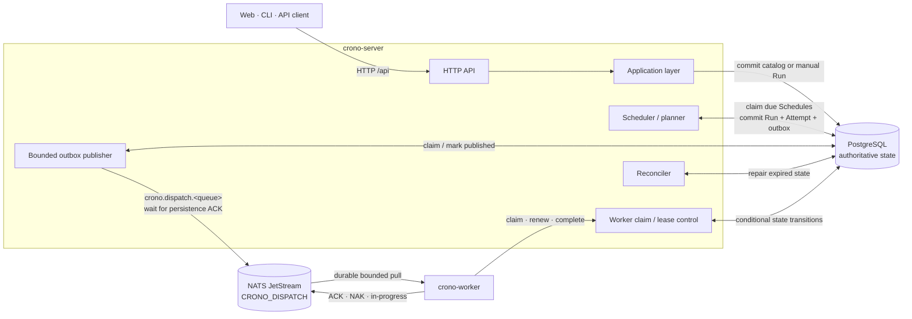
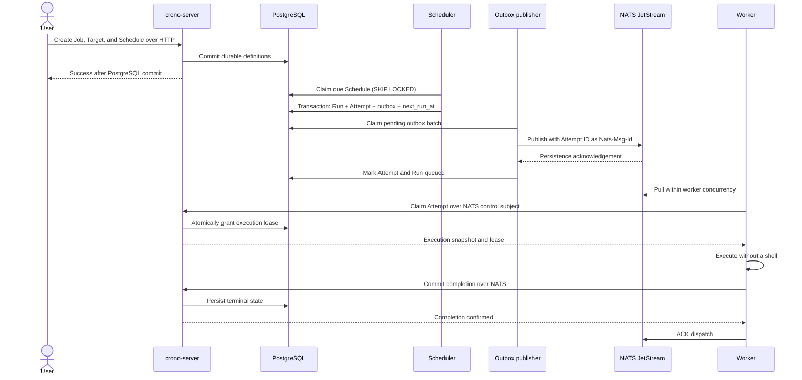
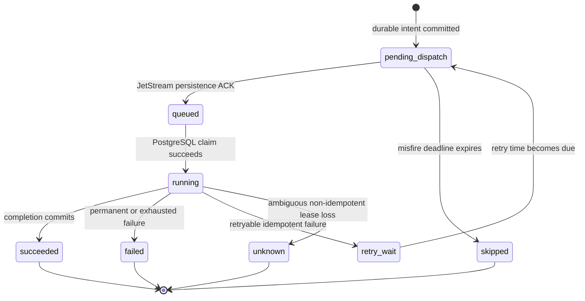
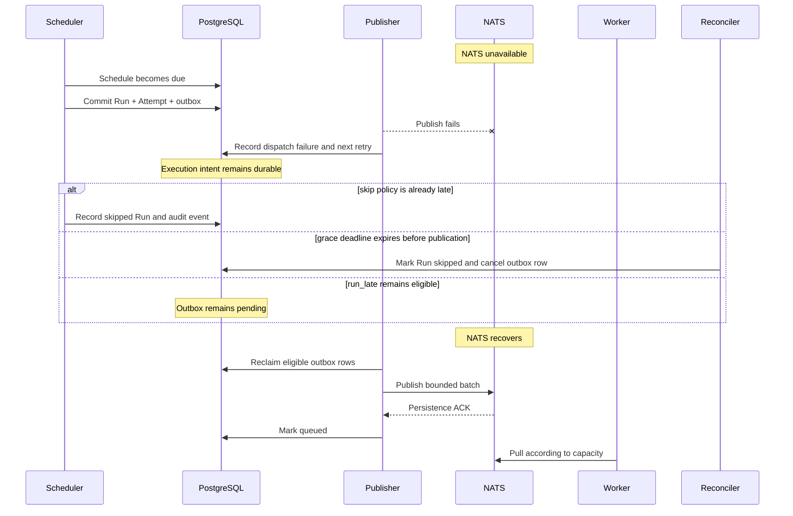
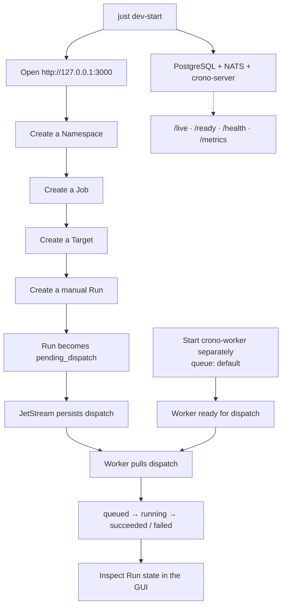

# Crono

Crono is a PostgreSQL-backed scheduler and execution control plane for infrastructure automation. It accepts manual Runs and durable one-shot or cron Schedules, dispatches eligible work through NATS JetStream, and executes it with a horizontally scalable worker pool.

The project is still a draft. Its HTTP and messaging contracts are intentionally unversioned, and the schema may be reset while the model is being established. The implementation uses Rust 2024, `async-nats` 0.50, SQLx 0.9, Utoipa 6, `utoipa-axum` 0.3, and `gloo-net` 0.7.

## Reliability architecture

PostgreSQL is the source of truth for Jobs, Targets, Schedules, calculated `next_run_at` cursors, Runs, Attempts, retry state, leases, misfires, dispatch state, and audit history. JetStream is a durable, high-throughput execution transport; it is not the scheduler database.



Creating a Schedule or Run succeeds after PostgreSQL commits and does not require NATS to be reachable. The scheduler atomically records every selected occurrence and its outbox event. A publisher later claims outbox rows in bounded batches, waits for a JetStream persistence acknowledgement, and only then marks the Attempt and Run queued. A publish that succeeded immediately before a publisher crash can be repeated; the stable Attempt ID is used as `Nats-Msg-Id`, and PostgreSQL claim transitions remain the correctness boundary after JetStream's finite duplicate window.

The implemented guarantee is:

```text
durable execution intent
+ at-least-once dispatch
+ idempotent logical processing
```

Crono does not claim exactly-once external side effects. A worker can complete a remote operation and crash before PostgreSQL records success. An expired lease therefore retries automatically only when the Job is marked idempotent and attempts remain. A non-idempotent ambiguous execution becomes `unknown`, leaving operator or resource-specific reconciliation to decide what is safe.

The normal scheduling and execution sequence is:



## Scheduling and misfires

The scheduler queries the indexed `next_run_at` cursor in bounded batches. PostgreSQL claims allow multiple server instances to operate concurrently without process-local locks, while `UNIQUE (schedule_id, scheduled_at)` prevents duplicate logical occurrences. There is no sleeping Tokio task per Schedule and no periodic full-table scan.

Cron expressions have five fields, use an IANA timezone for wall-clock calculation, and persist UTC instants. Nonexistent spring-forward times are skipped. Repeated fall-back local times produce both distinct UTC occurrences. One-shot timestamps are UTC.

Misfire policies are explicit and auditable:

- `run_late` creates dispatch intent even after the scheduled instant.
- `skip` records a terminal `skipped` Run and no outbox event once lateness exceeds the small scheduler polling allowance.
- `grace_period` dispatches only while lateness is within `misfire_grace_seconds`; expiry before publication is also reconciled to `skipped`.

Recurring backlog handling is independent of misfire handling:

- `skip` advances to the next future occurrence and records a bounded audit summary.
- `run_once`, the default, coalesces missed occurrences into one execution.
- `catch_up` materializes individual occurrences, bounded by `max_catchup_runs` and `max_catchup_age_seconds`. Defaults are 100 Runs and 24 hours.

## Execution state



Execution retries and dispatch retries are separate. NATS unavailability only increments outbox publication attempts; it never consumes a Job execution attempt. Job retry policy exposes `max_attempts`, initial and maximum backoff, multiplier, and jitter. Each retry creates a new immutable Attempt and outbox event for the same logical Run.

Workers share durable queue-scoped pull consumers and fetch no more messages than configured concurrency. A worker must claim an Attempt through the server's NATS request/reply control boundary before starting it. The claim is a conditional PostgreSQL transition. A duplicate delivery for a completed Attempt is acknowledged without execution; a delivery for a currently leased Attempt does not create a concurrent execution.

While a process runs, the worker refreshes its PostgreSQL lease and sends JetStream in-progress acknowledgements. Completion is committed to PostgreSQL before the dispatch is ACKed. The process executor uses an absolute executable directly without a shell, clears the environment except for a small allowlist, appends Target arguments to Job arguments, supplies inputs through `CRONO_INPUTS_FILE`, and retains bounded stdout/stderr tails.

## NATS assumptions

The server creates `CRONO_DISPATCH` for `crono.dispatch.*` with file storage, WorkQueue retention, explicit worker acknowledgements, bounded message size, and discard-new behavior. Development defaults to one replica. Set `CRONO_NATS_REPLICAS=3` for a three-node production JetStream cluster; valid values are 1, 3, and 5. Production NATS must use TLS, authenticated identities, and subject permissions that bind a worker to its identity-scoped control subjects and authorized queue.

The server starts and remains ready when NATS is unavailable as long as PostgreSQL is healthy. Its connection manager reconnects and re-establishes the stream. File-backed JetStream storage must be persistent across ordinary NATS restarts. Complete broker-storage loss requires explicit replay/reconciliation from PostgreSQL before affected queued work is considered recovered.

Outbox drain controls are independent from worker concurrency:

| Environment variable | Default | Meaning |
| --- | ---: | --- |
| `CRONO_OUTBOX_BATCH_SIZE` | `100` | Rows claimed in one publisher batch |
| `CRONO_OUTBOX_MAX_IN_FLIGHT` | `32` | Concurrent persistence acknowledgements |
| `CRONO_OUTBOX_CLAIM_LEASE_SECONDS` | `60` | Abandoned publisher claim timeout |
| `CRONO_OUTBOX_RETRY_INITIAL_MS` | `1000` | Initial dispatch retry delay |
| `CRONO_OUTBOX_RETRY_MAX_MS` | `60000` | Maximum dispatch retry delay |
| `CRONO_NATS_REPLICAS` | `1` | JetStream stream replicas |

## Reconciliation and outages

The reconciler is a bounded safety net. Indexed queries repair expired outbox claims, expire publication deadlines, create due execution retries, and resolve dead worker leases. The scheduler itself naturally revisits a past-due indexed cursor after a server or PostgreSQL interruption.

During a NATS outage, Schedule creation continues and due scheduler transactions continue creating Runs, Attempts, and outbox rows. The outbox accumulates safely in PostgreSQL. On reconnect, independent publisher and worker bounds drain it without spawning one task per Run. `run_late`, `skip`, and `grace_period` decisions remain recorded in Runs and schedule events instead of being inferred from logs.



## Reviewing locally

The GUI currently exercises Namespace, Job, Target, and manual Run workflows. Schedule APIs are implemented, while dedicated Schedule screens remain a useful next GUI improvement.



When reviewing failure behavior, stop NATS after creating the definitions but before a Run is dispatched. The GUI/API should remain usable, PostgreSQL should retain `pending_dispatch` work, `/health` should report degraded NATS state, and dispatch should resume after NATS restarts.

## Health and observability

`GET /live` reports process liveness. `GET /ready` requires PostgreSQL because durable state cannot be accepted without it. `GET /health` reports PostgreSQL and NATS separately; NATS failure is degraded transport health, not failed liveness or readiness. `GET /metrics` exports bounded-cardinality Prometheus metrics for scheduler decisions, execution lateness, outbox depth/age/publication, Run states, retries, active workers, expired leases, and NATS connectivity. Resource IDs appear in structured logs, never metric labels.

## Workspace

| Package | Responsibility |
| --- | --- |
| `services/server` | HTTP API, scheduler, PostgreSQL adapter, outbox publisher, worker control, reconciliation |
| `services/worker` | JetStream pull consumer, leases, ACK handling, and process execution |
| `apps/cli` | Server-independent command-line client boundary |
| `apps/web` | Independently deployed Leptos CSR client |
| `crates/api` | Shared transport-only DTOs |
| `crates/telemetry` | Structured logging and optional OTLP export |

Public routes use `/api` directly; there is no `/api/v1` or draft compatibility layer. `crono-server-openapi` emits the route-derived OpenAPI document.

The common development workflow is:

```sh
just dev-infra
cargo run --locked -p crono-server --bin crono-server -- --port 8080
cargo run --locked -p crono-worker -- run --queue default
```

PostgreSQL uses `CRONO_DATABASE_URL`, NATS uses `CRONO_NATS_URL`, and the worker accepts `--nats-url`, `--queue`, `--worker-id`, and `--concurrency`. Local defaults target loopback development services. Deployed public HTTP must sit behind TLS termination; clients do not receive NATS or PostgreSQL credentials.

Before review, run:

```sh
cargo fmt --all -- --check
just clippy
just test
cd apps/web && trunk build --release
```

The canonical draft schema and reset guidance are in [db/sql/README.md](db/sql/README.md). Domain invariants are in [DOMAIN_MODEL.md](DOMAIN_MODEL.md), authorization boundaries in [AUTHORIZATION.md](AUTHORIZATION.md), and CLI layering rules in [CLI_ARCHITECTURE.md](CLI_ARCHITECTURE.md).

## License

BSD 3-Clause. See [LICENSE](LICENSE).
