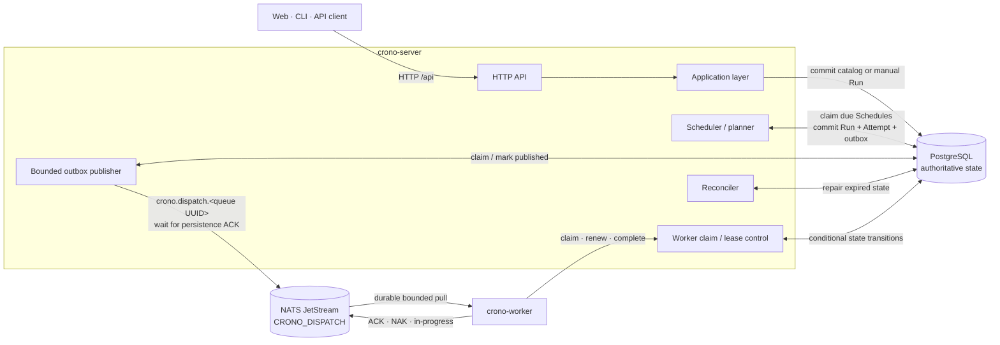
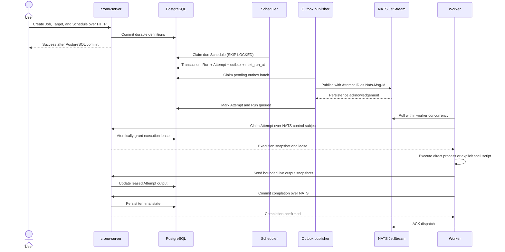
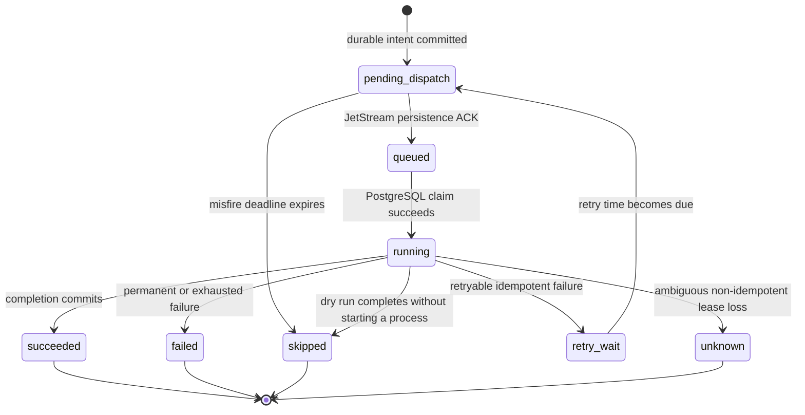
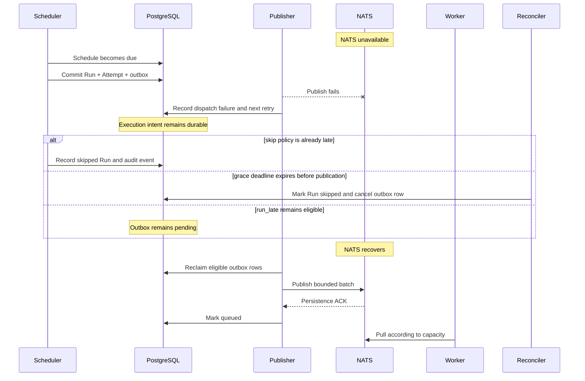
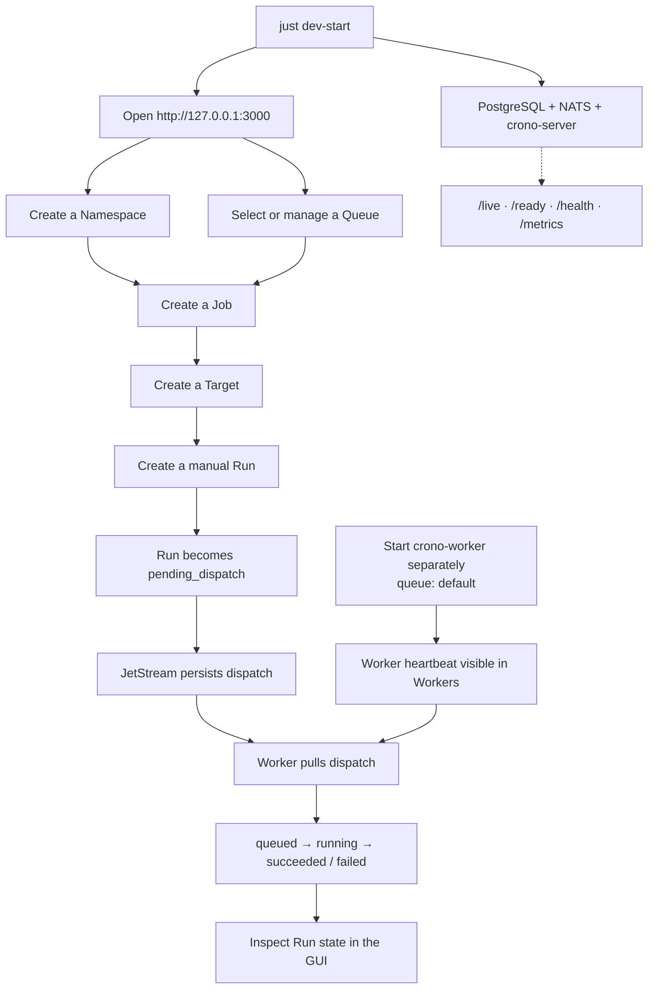

# Crono

Crono is a PostgreSQL-backed scheduler and execution control plane for infrastructure automation. It accepts manual Runs and durable one-shot or cron Schedules, dispatches eligible work through NATS JetStream, and executes it with a horizontally scalable worker pool.

The project is still a draft. Its HTTP and messaging contracts are intentionally unversioned, and the schema may be reset while the model is being established. The implementation uses Rust 2024, `async-nats` 0.50, SQLx 0.9, Utoipa 6, `utoipa-axum` 0.3, and `gloo-net` 0.7.

## Reliability architecture

PostgreSQL is the source of truth for Namespaces, Queues, Jobs, Targets, Target Sets, Schedules, calculated `next_run_at` cursors, Runs, Attempts, retry state, leases, misfires, dispatch state, and audit history. UUIDs are immutable identities and relationship keys. Canonical resource names are strict DNS-1123 labels used for lookup and display; the API rejects invalid input rather than normalizing it. JetStream is a durable, high-throughput execution transport; it is not the scheduler database.



Creating a Schedule or Run succeeds after PostgreSQL commits and does not require NATS to be reachable. The scheduler atomically records every selected occurrence and its outbox event. A publisher later claims outbox rows in bounded batches, waits for a JetStream persistence acknowledgement, and only then marks the Attempt and Run queued. A publish that succeeded immediately before a publisher crash can be repeated; the stable Attempt ID is used as `Nats-Msg-Id`, and PostgreSQL claim transitions remain the correctness boundary after JetStream's finite duplicate window.

The implemented guarantee is:

```text
durable execution intent
+ at-least-once dispatch
+ idempotent logical processing
```

Crono does not claim exactly-once external side effects. A worker can complete a remote operation and crash before PostgreSQL records success. An expired lease therefore retries automatically only when the Job is marked idempotent and attempts remain. A non-idempotent ambiguous execution becomes `unknown`, leaving operator or resource-specific reconciliation to decide what is safe.

The normal scheduling and execution sequence is:



## Scheduling and misfires

The scheduler queries the indexed `next_run_at` cursor in bounded batches. PostgreSQL claims allow multiple server instances to operate concurrently without process-local locks, while `UNIQUE (schedule_id, scheduled_at, target_id)` prevents duplicate per-Target occurrences. There is no sleeping Tokio task per Schedule and no periodic full-table scan. A Schedule aimed at a Target Set creates one independent Run for every current member in the same planning transaction.

Cron expressions have five fields, use an IANA timezone for wall-clock calculation, and persist UTC instants. Nonexistent spring-forward times are skipped. Repeated fall-back local times produce both distinct UTC occurrences. One-shot timestamps are UTC.

Five-field expressions are parsed with `cron-parser`; supported field syntax
includes wildcards, lists, ranges, steps, and `Sun` through `Sat` weekday
names. Crono keeps a bounded UTC overlap check so both fall-back occurrences
remain distinct even though they share one local wall-clock value.

Misfire policies are explicit and auditable:

- `run_late` creates dispatch intent even after the scheduled instant.
- `skip` records a terminal `skipped` Run and no outbox event once lateness exceeds the small scheduler polling allowance.
- `grace_period` dispatches only while lateness is within `misfire_grace_seconds`; expiry before publication is also reconciled to `skipped`.

Recurring backlog handling is independent of misfire handling:

- `skip` advances to the next future occurrence and records a bounded audit summary.
- `run_once`, the default, coalesces missed occurrences into one execution.
- `catch_up` materializes individual occurrences, bounded by `max_catchup_runs` and `max_catchup_age_seconds`. Defaults are 100 Runs and 24 hours.

## Execution state



Execution retries and dispatch retries are separate. NATS unavailability only increments outbox publication attempts; it never consumes a Job execution attempt. Job retry policy exposes `max_attempts`, initial and maximum backoff, multiplier, and jitter. Each retry creates a new immutable Attempt and outbox event for the same logical Run.

Queues are global UUID-backed resources managed through `/api/queues`. Jobs
store Queue UUIDs, while operators and worker configuration use canonical Queue
names. A worker resolves its configured name through the server at startup and
then shares a UUID-scoped durable pull consumer with other workers in that
pool. The system-managed `default` Queue is always present and enabled; other
Queues support rename, disable, and guarded deletion. Workers fetch no more
messages than configured concurrency. A worker must
claim an Attempt through the server's NATS request/reply control boundary before
starting it. The claim is a conditional PostgreSQL transition. A duplicate
delivery for a completed Attempt is acknowledged without execution; a delivery
for a currently leased Attempt does not create a concurrent execution.

While a process runs, the worker refreshes its PostgreSQL lease and sends JetStream in-progress acknowledgements. Completion is committed to PostgreSQL before the dispatch is ACKed. The `process` executor uses an absolute executable directly without a shell. The explicit `shell` executor runs a literal script with an absolute interpreter path (the web form defaults to `/bin/sh`) and passes rendered Job and Target arguments as `$1`, `$2`, and so on. Both modes clear the environment except for a small allowlist, supply inputs through `CRONO_INPUTS_FILE`, and retain bounded stdout/stderr tails. Shell source never interpolates `{{ ... }}`; putting templates in positional arguments keeps input data out of shell syntax.

After a successful claim, the worker builds a typed, serializable execution timeline for that Attempt. Events carry timestamps, an observation ID and per-observation sequence, Run/Attempt/Job/worker/Queue identity, and structured milestones: receipt, start, sanitized context and command, process start, stdout/stderr lines, exit, and terminal outcome. The observation ID distinguishes a later redelivery of the same Attempt; `(observation_id, sequence)` can serve as a future persistence key. A separate result-reporting failure event records an unconfirmed completion without falsely claiming that the process failed. The server has already merged inputs and rendered argv; the worker observes those immutable values rather than re-rendering them. The two child pipes are drained concurrently, with one event per line or final partial line. Non-UTF-8 output is decoded lossily; lines exceeding 64 KiB are drained but represented by an omission marker to bound memory and event size. Monotonic clocks measure process and total worker-observed duration. The timeline currently starts after claim, so it does not claim to measure queue wait. New snapshots carry the server-known manual or schedule trigger and the scheduled occurrence instant when applicable; older snapshots leave those details unknown.

`crono-worker run --log-format pretty` writes compact, run-attributed execution events to stderr; `--log-format json` writes one serialized event envelope per line. Worker-internal diagnostics remain separate `tracing` JSON logs. The event type lives in the shared `crono-execution` crate while the worker owns the sink and renderer, allowing a future NATS/API sink to forward the same envelopes to the server for a web timeline. The server does not yet persist the full event stream. A second bounded sink retains sanitized stdout/stderr tails and sends changed 16 KiB-per-stream snapshots about once per second over an identity-scoped NATS subject while the Attempt lease is valid. The authorized Attempt output endpoint can therefore show progress when refreshed during a Run; completion still records final 64 KiB tails. No output can appear before a process prints a complete line. Upload failures do not block pipe draining or determine job success. Synchronous console emission still provides bounded-memory backpressure rather than an unbounded queue.

Enable Dry run on a Job to inspect its future manual and scheduled Runs without starting the executable, even when the worker itself was not started with `--dry-run`. The setting is copied into each immutable Run snapshot; changing the Job does not change Runs already created. `crono-worker run --dry-run` applies the same behavior to every Job claimed by that worker. Either way, the worker still claims and acknowledges the Attempt, prints a sanitized resolved command to worker stdout and the Attempt's bounded stdout record, and reports both the Attempt and Run as skipped rather than successful. It never starts the process or creates an inputs file. Deploy the server/schema before new web and worker versions: an older server ignores the new completion marker and still records a dry run as succeeded. The Runs page loads Attempt output through `GET /api/runs/{run_id}/attempts` under the existing Run-read authorization. Known sensitive input keys and credential-like argv switches are redacted before events, dry-run output, and Attempt tails are emitted. This is a fallback, not a secret-management boundary: literal credentials, transformed secrets, and values under unrecognized keys may escape detection. Do not place credentials in Crono inputs or command arguments.

## Commands, templates, and inputs

A Job defines what runs: `noop`, direct `process`, or explicit `shell`; an absolute executable/interpreter for executing Jobs; ordered argument templates; default inputs; dry-run mode; and retry behavior. A Target defines where or with what destination-specific argument suffixes and inputs. A Target Set is an explicit collection of Targets plus inputs shared by every member; selecting one fans out to one Run per Target. Schedules and manual Runs can add a final invocation input layer.

Input objects merge from least to most specific:

```text
Job defaults < Target Set shared inputs < Target inputs < Schedule or manual Run inputs
```

Objects merge recursively. Arrays, scalar values, and `null` replace the less-specific value. Input keys must be safe template path segments, string values cannot contain NUL characters, and the complete encoded object is bounded to 64 KiB. Inputs are ordinary configuration, not a secret store; do not place credentials in them.

Arguments can interpolate scalar input leaves with `{{ path.to.value }}`. A placeholder may occupy all or part of one argument, but it can never create additional argv entries. Missing paths, `null`, objects, and arrays fail rendering before dispatch. Write `\{{` for a literal opening delimiter. The executable itself is never templated. Direct `process` never invokes a shell, so an Executable value such as `/usr/bin/sleep 10 && echo hello` is not a valid path. Select `shell` instead, set the interpreter to `/bin/sh`, and use a literal script such as `printf 'started\n'; /usr/bin/sleep 10; printf 'Hello, %s\n' "$1"` with the argument `{{ name }}`. This prints a line before the sleep so Refresh Output has progress to show. Crono clears `PATH`; prefer absolute command paths inside scripts. Jobs remain trusted code, and Crono inputs are not a secret store.

Before dispatch, the server merges inputs, renders argv, and stores the result in the immutable Run snapshot. The worker writes the final merged JSON to a permission-restricted temporary file and sets `CRONO_INPUTS_FILE` to that file's path only for the child process. The variable does not tell the worker to load a host-provided env file; the worker creates and deletes the file for each execution. `CRONO_RUN_ID` contains the stable Run idempotency key. A program can consume inputs directly, for example:

```sh
jq -r '.deployment.region' "$CRONO_INPUTS_FILE"
```

Changing a Job, Target, or Target Set affects only future snapshots. Existing Runs retain the exact executable, argument templates, rendered arguments, merged inputs, Job and Queue identity, and retry settings they were created with. Older snapshots without the added template and Job fields remain readable; their timeline omits those details.

Every worker session also sends a presence heartbeat through the server-mediated `crono.worker.presence.*` NATS boundary. Keeping presence separate from execution control prevents older control subscribers from consuming new heartbeat operations during rolling deployments. Unless overridden by `--worker-id` or `CRONO_WORKER_ID`, an ID combines a sanitized hostname and fresh random suffix for each process; it does not depend on a MAC address. PostgreSQL records the worker ID, process session, Queue UUID, concurrency, version, start time, last-seen time, and optional allowlisted diagnostics. `GET /api/workers` classifies a worker as online for 30 seconds after its last heartbeat, stale through two minutes, and offline afterward. `GET /api/workers/{worker_id}` requires global WorkerRead authorization and exposes platform, default `/bin/sh` presence, dry-run setting, and only the `LANG`, `LC_ALL`, and `TZ` values the child may inherit. It does not expose arbitrary worker environment, credentials, or NATS configuration. Older workers display diagnostics as unknown. Offline records remain useful for short incident review and are removed after seven days by bounded reconciliation. Presence is operational metadata only: it does not replace Attempt leases or make a NATS connection authoritative execution state.

## PostgreSQL connection pool

Each server instance uses one bounded pool for the API and its scheduler, reconciler, outbox publisher, and worker-control loops. Two connections stay warm so the constantly polling loops do not reconnect after every idle period, and a three-second acquire timeout turns pool exhaustion into a prompt `503 dependency_unavailable` response instead of a stalled request. Every connection is validated before use, and connections are labeled `crono-server` in `pg_stat_activity` unless the URL or `PGAPPNAME` sets another name. On shutdown the server stops the API and background loops, then closes the pool so PostgreSQL sees clean session terminations. Size `CRONO_DATABASE_MAX_CONNECTIONS` across all instances so the fleet stays below the database's own connection limit. Invalid or out-of-range values stop startup instead of falling back to defaults.

| Environment variable | Default | Allowed range | Meaning |
| --- | ---: | --- | --- |
| `CRONO_DATABASE_MAX_CONNECTIONS` | `20` | 1–200 | Most connections one instance may open |
| `CRONO_DATABASE_MIN_CONNECTIONS` | `2` | 0 up to the maximum | Connections kept open while idle |
| `CRONO_DATABASE_ACQUIRE_TIMEOUT_MS` | `3000` | 100–30000 ms | Longest wait for a free connection |
| `CRONO_DATABASE_IDLE_TIMEOUT_SECONDS` | `600` | 10 s or more, below the lifetime | Idle time before a connection above the minimum closes |
| `CRONO_DATABASE_MAX_LIFETIME_SECONDS` | `1800` | 60–86400 s | Age at which any connection is replaced |

## NATS assumptions

The server creates `CRONO_DISPATCH` for `crono.dispatch.*` with file storage, WorkQueue retention, explicit worker acknowledgements, bounded message size, and discard-new behavior. The final subject token is the immutable Queue UUID, so renaming a Queue does not reroute durable work. Development defaults to one replica. Set `CRONO_NATS_REPLICAS=3` for a three-node production JetStream cluster; valid values are 1, 3, and 5. Production NATS must use TLS, authenticated identities, and subject permissions that bind a worker to its identity-scoped control and presence subjects and authorized Queue UUID.

The server starts and remains ready when NATS is unavailable as long as PostgreSQL is healthy. Its connection manager reconnects and re-establishes the stream. File-backed JetStream storage must be persistent across ordinary NATS restarts. Complete broker-storage loss requires explicit replay/reconciliation from PostgreSQL before affected queued work is considered recovered.

Outbox drain controls are independent from worker concurrency:

| Environment variable | Default | Meaning |
| --- | ---: | --- |
| `CRONO_OUTBOX_BATCH_SIZE` | `100` | Rows claimed in one publisher batch |
| `CRONO_OUTBOX_MAX_IN_FLIGHT` | `32` | Concurrent persistence acknowledgements |
| `CRONO_OUTBOX_CLAIM_LEASE_SECONDS` | `60` | Abandoned publisher claim timeout |
| `CRONO_OUTBOX_RETRY_INITIAL_MS` | `1000` | Initial dispatch retry delay |
| `CRONO_OUTBOX_RETRY_MAX_MS` | `60000` | Maximum dispatch retry delay |
| `CRONO_NATS_REPLICAS` | `1` | JetStream stream replicas |

## Reconciliation and outages

The reconciler is a bounded safety net. Indexed queries repair expired outbox claims, expire publication deadlines, create due execution retries, and resolve dead worker leases. The scheduler itself naturally revisits a past-due indexed cursor after a server or PostgreSQL interruption.

During a NATS outage, Schedule creation continues and due scheduler transactions continue creating Runs, Attempts, and outbox rows. The outbox accumulates safely in PostgreSQL. On reconnect, independent publisher and worker bounds drain it without spawning one task per Run. `run_late`, `skip`, and `grace_period` decisions remain recorded in Runs and schedule events instead of being inferred from logs.



## Reviewing locally

The GUI exercises Namespace, Queue, Job, Target, Target Set, Schedule, and manual Run workflows. Queue administration supports rename, enable/disable, and guarded deletion. Existing relationships are searchable name selectors backed by UUIDs. `/jobs` browses Jobs within a selected Namespace; its sidebar submenu and page action lead to `/jobs/new`, while each Job's Edit link opens `/jobs/{id}/edit`. Creation is never the default Jobs view, and a direct edit URL reloads the Job from the API. Job, Target, and Target Set definitions can be edited without replacing their immutable IDs. The Job editor previews rendered argv and merged inputs against a selected Target or Target Set without creating a Run; later invocation inputs are not part of that preview.

Execution → Runs now opens `/runs`, a server-filtered, cursor-paged history instead of a manual Run form. Its history aligns Job/Target, Started, Finished, and Status in columns on wide screens and labels the same fields on smaller screens. Start and finish show seconds, with explicitly labeled elapsed time beneath the finish and exact timestamps available on hover; missing timestamps remain unrecorded rather than being inferred. Details, Output, and Re-run actions retain visible text beside their icons. Use `/runs/new` to start a Job explicitly, or `/runs/{id}` to inspect exact server timestamps, status, Queue, attempt count, and durable server lifecycle events. Attempt output remains a separate on-demand `RunRead` request, not part of the list or timeline response. The trigger source is established by the server: manual HTTP requests are labeled API (including CLI-originated requests until verified client identity is available), scheduled Runs are Scheduler, and repeated Runs are Re-run. No username is inferred in development mode. Names in history reflect current catalog names; the execution snapshot retains what actually ran.

Re-run requires confirmation and repeats one Run's immutable executable, resolved arguments, merged inputs, Queue, dry-run setting, and retry policy. Only confirmed terminal outcomes are eligible; `unknown` may have executed despite lost result reporting and is excluded. Run details show Refresh status and opened Attempt output shows Refresh output only for nonterminal states, because terminal outcomes are immutable. The server creates a new Run, Attempt, and outbox dispatch with a fresh execution identity and a `rerun_of_run_id` link, leaving the source untouched. For a Run that belonged to a Target Set batch, only that individual Target is repeated. The caller still needs `RunRead`, `JobExecute`, `TargetUse`, and `RunCreate`, and the original Queue must still be enabled for a new request. The browser does not receive the secret-bearing snapshot or show merged inputs in the confirmation; the server copies them internally. `POST /api/runs/{id}/rerun` uses an idempotent request UUID. `GET /api/runs/{id}/events` currently exposes only server-observed lifecycle names and timestamps, not worker `ExecutionEvent` payloads; persisting that richer stream is future work.



When reviewing failure behavior, stop NATS after creating the definitions but before a Run is dispatched. The GUI/API should remain usable, PostgreSQL should retain `pending_dispatch` work, `/health` should report degraded NATS state, and dispatch should resume after NATS restarts.

## Health and observability

`GET /live` reports process liveness. `GET /ready` requires PostgreSQL because durable state cannot be accepted without it. `GET /health` reports PostgreSQL and NATS separately; NATS failure is degraded transport health, not failed liveness or readiness. `GET /api/workers` reports authorized heartbeat-backed presence for the Workers screen. `GET /metrics` exports bounded-cardinality Prometheus metrics for scheduler decisions, execution lateness, outbox depth/age/publication, Run states, active execution leases, expired leases, and NATS connectivity. Resource IDs appear in structured logs, never metric labels.

Every HTTP response carries an `x-request-id` header holding a server-issued UUIDv7. The same value appears as `request_id` on the request's log span, alongside the method and the matched route template (for example `/api/runs/{run_id}`), so a failing response can be matched to its server logs. Crono never adopts a client-supplied `x-request-id` as its correlation ID; a short, printable client value is logged separately as `client_request_id`. This header is unrelated to the `request_id` idempotency key in `POST /api/runs` and re-run request bodies.

The System → Monitor page (`/monitor`) calls operator-authorized `GET /api/monitor` for a live, read-only snapshot. It refreshes every 30 seconds while open and can be refreshed manually; it does not retain history. PostgreSQL-backed counts show enabled and due Schedules, the earliest pending occurrence, unpublished outbox depth and age, queued and running Runs, and online worker presence. Database size covers the entire connected PostgreSQL database, not just the `crono` schema. Database connection count is database-wide, while connection-pool usage, JetStream availability, and the scheduler/publisher last successful database-poll times describe only the API instance answering the request. A missing database sample is shown as unavailable rather than reusing stale values. `MonitorRead` is a separate control-plane capability for a future operator policy; the current server-owned development identity grants it. The page does not expose credentials or execution payloads, and `/metrics` remains the source for Prometheus counters and long-term external monitoring.

## API contract

The OpenAPI document is generated from the same routes the server registers, and a copy is committed at `docs/openapi/crono-server.json` as the versioned HTTP contract. Committing it keeps every API change visible in review, gives each release tag an exact record of the contract it shipped, and lets documentation and contract tooling work without building or running the server. The running server does not serve the document or a documentation UI, so the API exposes no route beyond its real operations.

Every error response uses one JSON shape, `{"error": {"code", "message", "field"}}`, where `code` is a stable machine-readable value and `field` names the offending input when known. That includes requests rejected before any use case runs: malformed or unknown-field JSON bodies, non-UUID path segments, and unparsable query strings return `400 invalid_request`; bodies over 2 MiB return `413 payload_too_large`; a JSON body without a JSON content type returns `415 unsupported_media_type`; unknown routes return `404 not_found`; and unsupported methods return `405 method_not_allowed` with an `Allow` header. Rejection messages describe only the caller's input and are capped at 256 characters. List `after` cursors must be values returned by a previous page, and text PostgreSQL cannot store (such as NUL characters) is reported as `400 invalid_request` rather than a server error.

The document lists every status an operation can return. Shared failures are declared once as reusable responses: every `/api` operation documents `401`, `403`, `500`, and `503`; operations with parameters or a body add `400`; and operations with a body add `413` and `415`. Handler annotations describe success bodies and operation-specific `400`, `404`, and `409` cases, request names carry their DNS-1123 pattern and 63-character limit, and list `limit` parameters declare their 1–100 range.

Regenerate the file with `just openapi` whenever a handler, request or response type, or the crate version changes; the version is part of the document, so a release bump also changes it. The `committed_openapi_document_matches_generated_output` test fails `just test` when the committed file differs from the generated output, which keeps the file trustworthy for every tool that reads it.

Breaking changes are checked with [oasdiff](https://github.com/oasdiff/oasdiff), pinned as a container image. Run `just api-breaking` before pushing: it compares the contract at `HEAD` with `origin/main`, prints the changelog, and fails on definite (ERR-level) breaking changes such as a removed field, a new required parameter, or a tightened constraint. When a break is intentional, record why in the commit message with a trailer, for example `API-Breaking: rename Run status values to match the lifecycle`; any such trailer in the compared range turns the failure into a report. The `API Contract` workflow runs the same `scripts/api-breaking.sh` on every push to `main` against the previous tip and writes the changelog to the job summary. A red run after a push cannot block anything, so the local check is the real gate.

## Workspace

| Package | Responsibility |
| --- | --- |
| `services/server` | HTTP API, scheduler, PostgreSQL adapter, outbox publisher, worker control, reconciliation |
| `services/worker` | JetStream pull consumer, leases, ACK handling, and process execution |
| `apps/cli` | Server-independent command-line client boundary |
| `apps/web` | Independently deployed Leptos CSR client |
| `crates/api` | Shared transport-only DTOs |
| `crates/execution` | Deterministic JSON input validation, merging, and argv template rendering |
| `crates/telemetry` | Structured logging and optional OTLP export |

Public routes use `/api` directly; there is no `/api/v1` or draft compatibility layer. `crono-server-openapi` prints the route-derived OpenAPI document; the committed copy and its checks are described in [API contract](#api-contract).

Run `just dev-start` to launch the API and live-reloading web application
together. It stops stale server and web processes from this checkout, prepares
PostgreSQL and NATS, builds the API, then launches the built server and Trunk
directly. It waits for API readiness before starting the web proxy and stops
the sibling process when either application exits. Running it again replaces
the previous stack, and an intentional stop ends its foreground launcher
successfully. Ports occupied by unrelated processes are reported rather
than forcibly cleared. `just dev-stop` works from another shell, even if the
original launcher is gone: it stops this checkout's server, web, and worker
processes plus the named `crono-postgres` and `crono-nats` containers. Container
volumes are preserved. The process cleanup uses Linux `/proc` and `flock` to
scope and coordinate these commands, including binaries replaced by a rebuild.
Startup uses `ss` to check listeners on every IPv4 and IPv6 address immediately
before binding each fixed port; an unrelated port owner is shown but never
killed. The API sets `SO_REUSEADDR` so normal quick restarts work after an
accepted connection without permitting two live listeners on one port. A
one-time restart from an older binary that lacked this socket option may still
need its closed TCP connections to expire.

The common development workflow is:

```sh
just dev-infra
cargo run --locked -p crono-server --bin crono-server -- --port 8080
just worker
```

`just worker` starts a hostname-labeled worker on the `default` Queue with concurrency `3`,
verbose diagnostics, and a pretty execution timeline on stderr. Queue, worker
ID, concurrency, verbosity, and timeline format are positional overrides, for
example `just worker priority worker-02 6 -vv json`. Use
`just worker default worker-01 3 -v json` to inspect JSON event envelopes.

To discard all local Crono PostgreSQL and JetStream state and recreate both
services from empty named volumes, run `just dev-reset`. The command requires
confirmation and only targets the `crono-postgres` and `crono-nats` development
containers and their named volumes. The canonical bootstrap upgrades the
preceding local draft schema in place, so the reset is optional when a truly
empty environment is useful rather than a requirement for `just dev-start`.

PostgreSQL uses `CRONO_DATABASE_URL`, NATS uses `CRONO_NATS_URL`, and the worker accepts `--nats-url`, `--queue`, `--worker-id`, `--concurrency`, `--dry-run`, and `--log-format pretty|json`. Local defaults target loopback development services. Deployed public HTTP must sit behind TLS termination; clients do not receive NATS or PostgreSQL credentials.

Before review, run:

```sh
cargo fmt --all -- --check
just clippy
just openapi
just test
just api-breaking
cd apps/web && trunk build --release
```

The canonical draft schema and reset guidance are in [db/sql/README.md](db/sql/README.md). Domain invariants are in [DOMAIN_MODEL.md](DOMAIN_MODEL.md), authorization boundaries in [AUTHORIZATION.md](AUTHORIZATION.md), and CLI layering rules in [CLI_ARCHITECTURE.md](CLI_ARCHITECTURE.md).

## License

BSD 3-Clause. See [LICENSE](LICENSE).
